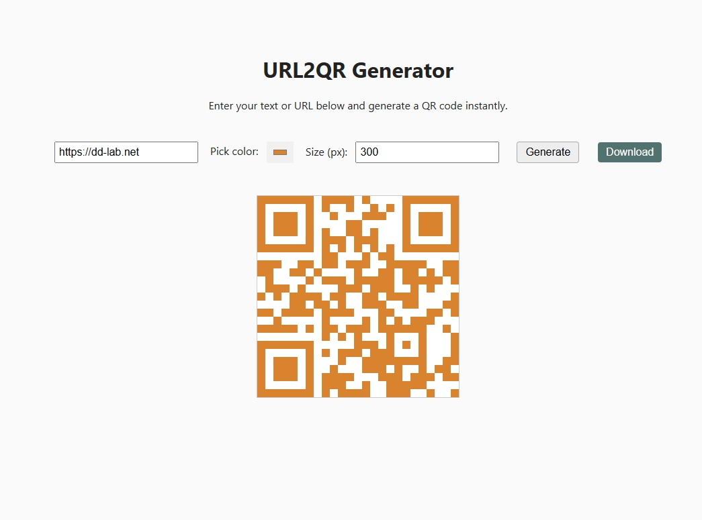

# URL2QR

**URL2QR** je lagana, samostalna PHP aplikacija za generiranje QR kodova iz URL-ova ili bilo kojeg teksta.  
Izrađena je za učenje, lokalni hosting (npr. XAMPP / Proxmox / LAN), i jednostavno dijeljenje linkova ili Wi-Fi pristupa putem QR koda.

---

## 🚀 Funkcionalnosti (v0.2.0)

- 🔗 Unos bilo kojeg URL-a ili teksta  
- 🎨 Odabir boje QR koda putem color pickera  
- 📏 Promjena veličine (100 – 2000 px)  
- 🧾 Preuzimanje PNG datoteke s pametnim nazivom (`qr_dd-lab_net.png`)  
- ⚡ Instant preview bez reloadanja  
- 🧰 Čisti PHP + HTML + JS (nema frameworka ni dependencija)

---

## 🖼️ Izgled aplikacije




---

## 💻 Kako pokrenuti

### Lokalne instalacije (npr. XAMPP)
1. Kloniraj repozitorij:
   ```bash
   git clone https://github.com/dklobucaric/URL2QR.git
   cd URL2QR
2. Kopiraj u svoj lokalni web direktorij (npr. C:\xampp\htdocs\URL2QR)

3. Otvori u pregledniku:
👉 http://localhost/URL2QR/public/


### Struktura projekta

```text
URL2QR/
│
├── public/
│   ├── index.php        # Glavno korisničko sučelje (forma + preview)
│   ├── qr.php           # Generira QR PNG u browser
│   ├── download.php     # Generira QR PNG i prisilno pokreće download
│   └── style.css        # Osnovni stilovi (ako želiš dodatno urediti)
│
├── src/
│   ├── phpqrcode.php    # Glavna QR biblioteka (PHP QR Code 1.1.4)
│   ├── QrMatrix.php     # Logika generiranja QR matrice
│   └── QrRender.php     # Iscrtavanje QR-a u PNG
│
└── README.md
